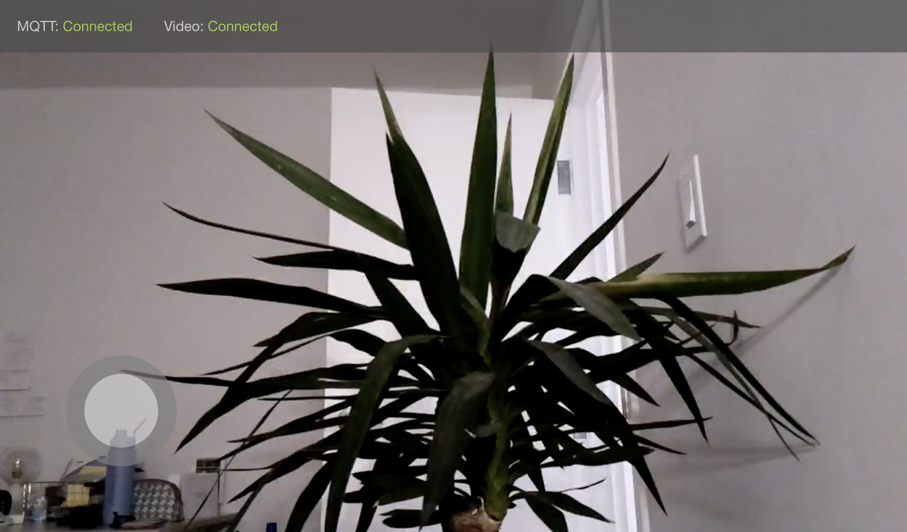

# Rovy Mobile App (Ionic React)

## Setup Environment

`$ export AWS_ROVY_KEY=<AWS ACCESS KEY>`

`$ export AWS_ROVY_SECRET=<AWS SECRET ACCESS KEY>`

`$ export AWS_ROVY_REGION=<AWS REGION>`

`$ export AWS_ROVY_MQTT_ENDPOINT=<MQTT ENDPOINT>`

## Development

`$ npm install`

`$ ionic serve`

## Add platform for ios

`$ ionic capacitor add ios`

## Add platform for android

`$ ionic capacitor add android`

## Build Locally

`$ npm install`

`$ ionic build`
